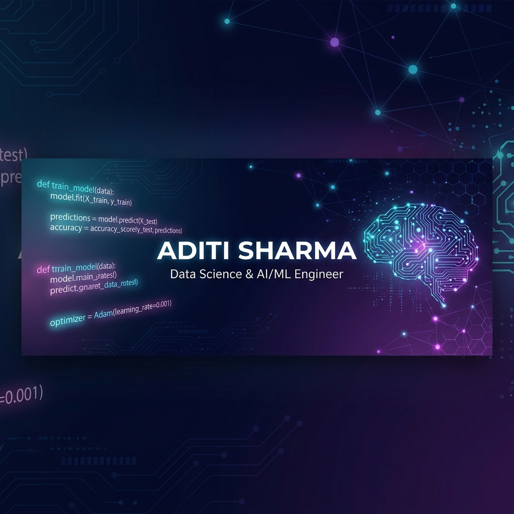

<!-- ═══════════════════════════════════════════════════════════════════════════
     🚀  ADITI SHARMA — GitHub Profile README
     ═══════════════════════════════════════════════════════════════════════════ -->

<!-- ╔══════════════════════════════════════════════════════════════╗
     ║                    BANNER / HEADER                          ║
     ╚══════════════════════════════════════════════════════════════╝ -->

  

 

<!-- ╔══════════════════════════════════════════════════════════════╗
     ║                   TYPING ANIMATION                          ║
     ╚══════════════════════════════════════════════════════════════╝ -->

  

 

<!-- ╔══════════════════════════════════════════════════════════════╗
     ║                   PROFILE BADGES                            ║
     ╚══════════════════════════════════════════════════════════════╝ -->

  
  &nbsp;
  
  &nbsp;
  

 

<!-- ╔══════════════════════════════════════════════════════════════╗
     ║                    ABOUT ME                                 ║
     ╚══════════════════════════════════════════════════════════════╝ -->

##  &nbsp; About Me

<ul>
  <li>
    
    &nbsp; Passionate about <strong>Machine Learning, Deep Learning, NLP & LLMs</strong>
  </li>
  <li>
    
    &nbsp; Currently building <strong>Autonomous AI Agents</strong> with <strong>RAG, LangChain & LangGraph</strong>
  </li>
  <li>
    
    &nbsp; Skilled in <strong>Computer Vision, Reinforcement Learning & Recommender Systems</strong>
  </li>
  <li>
    
    &nbsp; DevOps enthusiast — <strong>Azure, Kubernetes, Terraform, Docker, CI/CD</strong>
  </li>
  <li>
    
    &nbsp; Reach me at: <a href="mailto:aditisharma20004@gmail.com"><strong>aditisharma20004@gmail.com</strong></a>
  </li>
</ul>

 

---

<!-- ╔══════════════════════════════════════════════════════════════╗
     ║                 SOCIAL / CONNECT SECTION                    ║
     ╚══════════════════════════════════════════════════════════════╝ -->

##  &nbsp; Let's Connect

  
  &nbsp;&nbsp;
  
  &nbsp;&nbsp;
  
  &nbsp;&nbsp;
  

 

---

<!-- ╔══════════════════════════════════════════════════════════════╗
     ║                   TECH STACK / SKILLS                       ║
     ╚══════════════════════════════════════════════════════════════╝ -->

##  &nbsp; Technical Skills

### 💻 Languages

  
  
  
  
  
  

### 🧠 Machine Learning & AI

  
  
  
  
  
  
  
  
  
  
  

### ☁️ Cloud & DevOps

  
  
  
  
  

### 🛠️ Libraries, Frameworks & Tools

  
  
  
  
  
  
  
  
  
  

 

---

<!-- ╔══════════════════════════════════════════════════════════════╗
     ║                  GITHUB STATS SECTION                       ║
     ╚══════════════════════════════════════════════════════════════╝ -->

##  &nbsp; GitHub Stats

  
  &nbsp;
  

 

  

 

<!-- ╔══════════════════════════════════════════════════════════════╗
     ║               CONTRIBUTION GRAPH & SNAKE                    ║
     ╚══════════════════════════════════════════════════════════════╝ -->

##  &nbsp; Contribution Graph

  <picture>
    <source media="(prefers-color-scheme: dark)" srcset="https://raw.githubusercontent.com/jiya2000/jiya2000/output/github-snake-dark.svg"/>
    <source media="(prefers-color-scheme: light)" srcset="https://raw.githubusercontent.com/jiya2000/jiya2000/output/github-snake.svg"/>
    
  </picture>

 

---

<!-- ╔══════════════════════════════════════════════════════════════╗
     ║                ACTIVITY GRAPH                               ║
     ╚══════════════════════════════════════════════════════════════╝ -->

##  &nbsp; Contribution Activity

  

 

---

<!-- ╔══════════════════════════════════════════════════════════════╗
     ║                    FOOTER                                   ║
     ╚══════════════════════════════════════════════════════════════╝ -->

  

